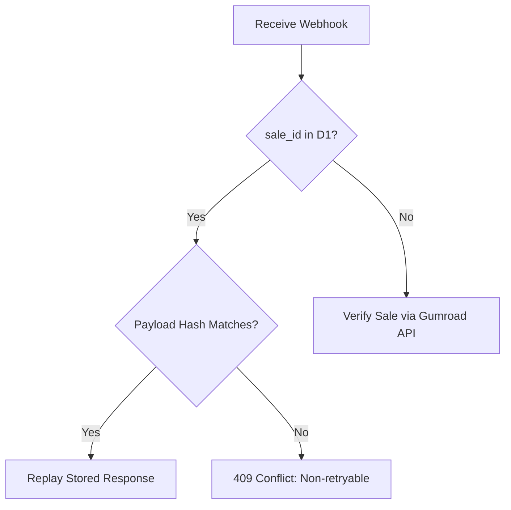
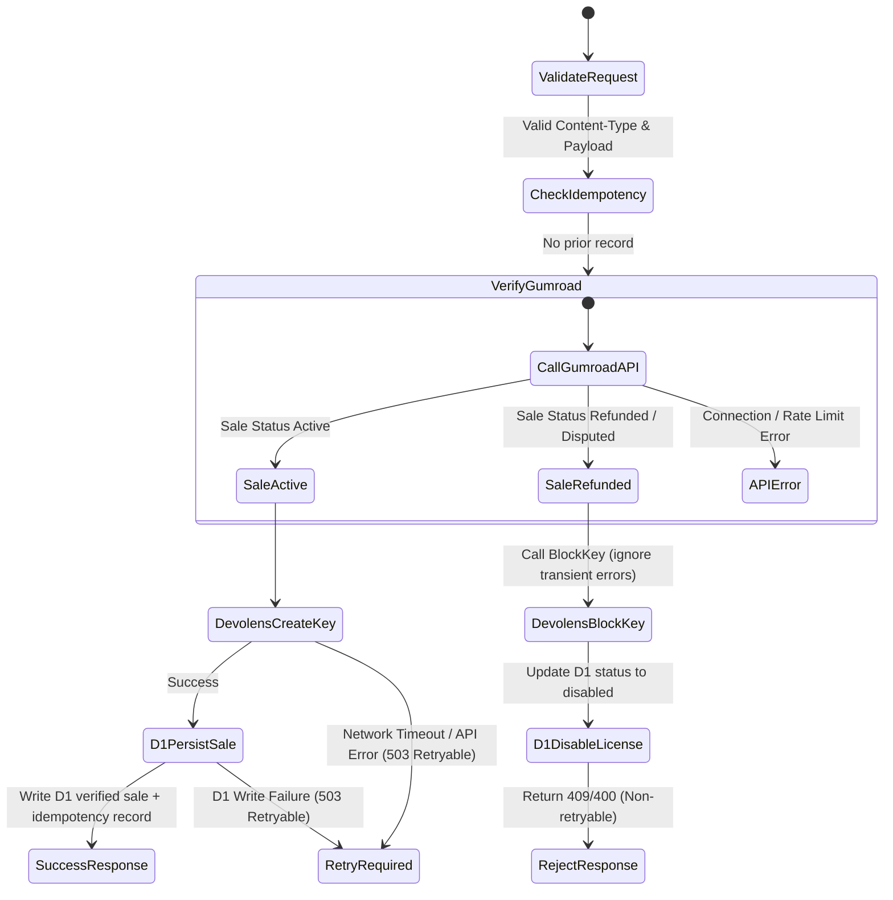

# Gumroad Webhook State & Failure Policy

This document defines the behavior, validation rules, idempotency contracts, and failure outcomes for the Cloudflare Worker Gumroad webhook integration.

## 1. Webhook Validation & Request Signature

| Field / Attribute | Expected Value / Type | Purpose | Failure Outcome |
| :--- | :--- | :--- | :--- |
| **Content-Type** | `application/x-www-form-urlencoded` | Standard Gumroad payload format. | **400 Bad Request** (Non-retryable) |
| **sale_id** | `String` (form field) | Unique Gumroad sale identifier. | **400 Bad Request** (Non-retryable) |
| **product_id** | `String` (form field) | Identifies the purchased product. | **400 Bad Request** (Non-retryable) |
| **email** | `String` (form field) | Purchaser email address. | **400 Bad Request** (Non-retryable) |

---

## 2. Idempotency & Replay Handling

To ensure webhook execution is replay-safe, the Worker checks D1 idempotency records using the `sale_id` as the key.

---

## 3. Webhook Flow State Machine

---

## 4. Failure Recovery & Operator Escalation Guide

| Failure Scenario | Error Code | HTTP Status | Retryable? | Operator/System Action |
| :--- | :--- | :--- | :--- | :--- |
| **Mismatched Replay Hash** | `invalid_transition` | 409 | No | **Block / Escalate**: Indicates tampering or payload drift for the same `sale_id`. Do not retry. |
| **Gumroad API Down** | `worker_unreachable` | 503 | Yes | **Retry**: Transient API error. Gumroad should retry the webhook delivery automatically. |
| **Gumroad Sale Not Found** | `not_found` | 404 | No | **Investigate**: Handled as terminal. Could be a test sale or invalid product/sale ID. |
| **Devolens CreateKey Fails** | `worker_unreachable` | 503 | Yes | **Retry**: Ensure Devolens is reachable. If failure persists &gt;24 hours, manually provision the key on Devolens. |
| **Devolens BlockKey Fails** | - | - | Yes | **Ignore/Fallback**: BlockKey network errors are ignored so the webhook finishes, but D1 is updated to `disabled`. Monitor audit logs for unsynced blocks. |
| **D1 Database Write Fails** | `storage` | 503 | Yes | **Retry**: SQL constraint or database availability issue. The transaction aborts; Gumroad must retry the webhook. |

---

## 5. Security & Privacy Safeguards

1. **Verification First**: No mutation (either D1 write or Devolens CreateKey/BlockKey) is performed until the sale is verified directly against the Gumroad API using `GUMROAD_ACCESS_TOKEN`.
2. **Encryption**: Plaintext license keys are normalized but never logged or stored in plain D1 columns without hashing.
