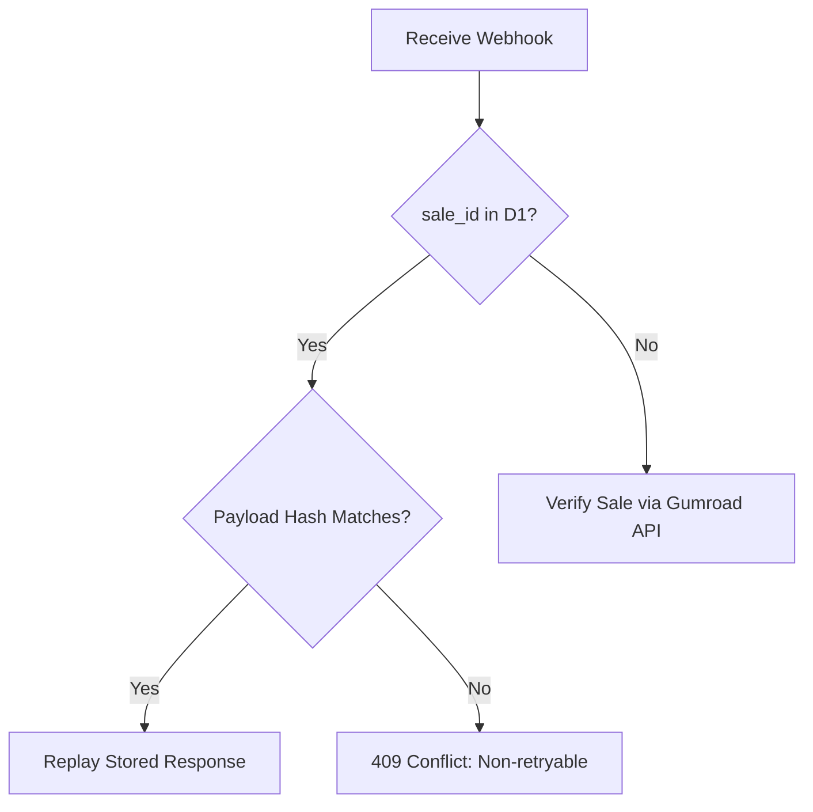
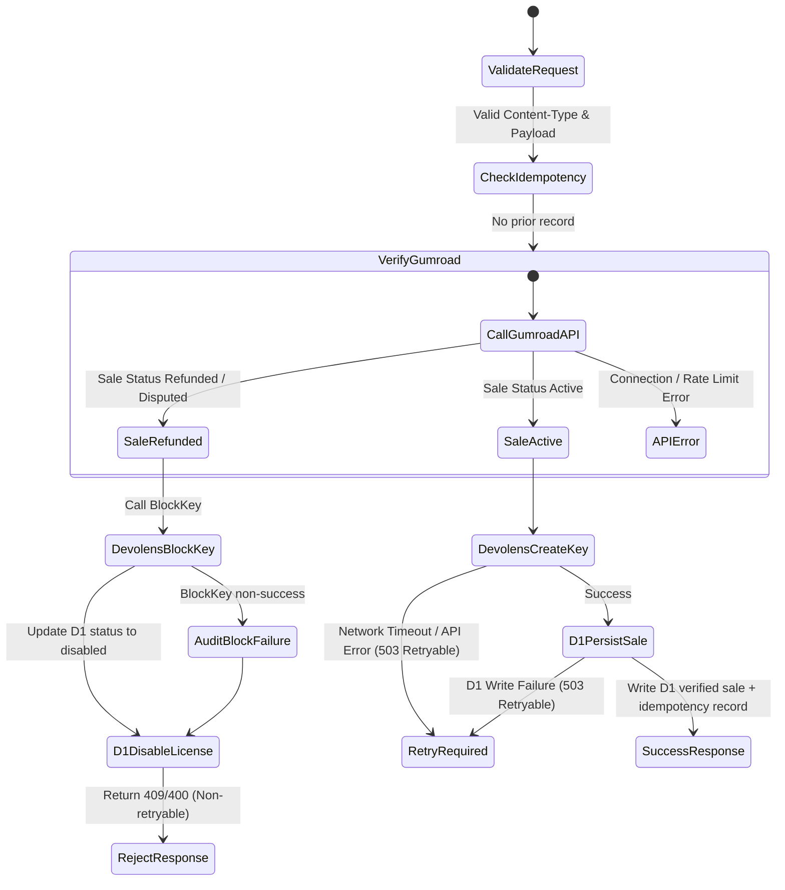

# Gumroad Webhook State & Failure Policy

This document defines the behavior, validation rules, idempotency contracts, and failure outcomes for the Cloudflare Worker Gumroad webhook integration.

## 1. Webhook Validation & Request Signature

| Field / Attribute | Expected Value / Type | Purpose | Failure Outcome |
| :--- | :--- | :--- | :--- |
| **Content-Type** | `application/x-www-form-urlencoded` | Standard Gumroad payload format. | **400 Bad Request** (Non-retryable) |
| **sale_id** | `String` (form field) | Unique Gumroad sale identifier. | **400 Bad Request** (Non-retryable) |
| **product_id** | `String` (form field) | Identifies the purchased product. | **400 Bad Request** (Non-retryable) |
| **email** | `String` (form field) | Purchaser email address. | **400 Bad Request** (Non-retryable) |

---

## 2. Idempotency & Replay Handling

To ensure webhook execution is replay-safe, the Worker checks D1 idempotency records using the `sale_id` as the key.

---

## 3. Webhook Flow State Machine

---

## 4. Failure Recovery & Operator Escalation Guide

| Outcome | Error Code | HTTP Status | Retryable? | Idempotency / D1 / Audit Effect | Operator/System Action |
| :--- | :--- | :--- | :--- | :--- | :--- |
| **Invalid Content-Type or Missing Form Fields** | `bad_request` | 400 | No | No idempotency record, no Devolens call, no D1 mapping/audit write. | **Fix Sender**: Gumroad pings must be form encoded and include `sale_id`, `product_id`, and `email`. |
| **Duplicate Matching Payload** | Stored response | Stored status | Stored flag | Replays stored idempotency response. No Gumroad, Devolens, D1 mapping, or audit side effect is repeated. | **No Action**: Safe replay. |
| **Duplicate Mismatched Payload** | `invalid_transition` | 409 | No | No Gumroad or Devolens call. No D1 mapping/audit write. | **Block / Escalate**: Indicates tampering or payload drift for the same `sale_id`. Do not retry. |
| **Gumroad API Down** | `worker_unreachable` | 503 | Yes | No idempotency record, no Devolens call, no D1 mapping/audit write. | **Retry**: Transient API error. Gumroad should retry the webhook delivery automatically. |
| **Gumroad Sale Not Found** | `not_found` | 404 | No | No idempotency record, no Devolens call, no D1 mapping/audit write. | **Investigate**: Handled as terminal. Could be a test sale or invalid product/sale ID. |
| **Invalid Gumroad Provider Payload** | `serialization` | 503 | No | No idempotency record, no Devolens call, no D1 mapping/audit write. | **Escalate**: Provider response shape is not compatible with the verified-sale contract. |
| **Verified Sale Missing License Key** | `invalid_transition` | 409 | No | No idempotency record, no Devolens call, no D1 mapping/audit write. | **Escalate**: Verified sale cannot be provisioned without a Gumroad license key. |
| **Refunded or Disputed Sale** | `invalid_transition` | 409 | No | Attempts Devolens `BlockKey`, updates compatibility D1 license status to `disabled`, writes `license_disabled` audit. | **No Retry**: Sale is not eligible for activation. |
| **Refund BlockKey Fails** | `invalid_transition` | 409 | No | Writes `gumroad_refund_devolens_block_failed` audit when possible, then still updates compatibility D1 status and writes `license_disabled`. | **Manual Follow-up**: Check audit events and block the key in Devolens if the failed BlockKey did not complete later. |
| **Devolens CreateKey HTTP/Network Failure** | `worker_unreachable` | 503 | Yes | No idempotency record and no D1 mapping/audit write. | **Retry**: Ensure Devolens is reachable. If failure persists &gt;24 hours, manually provision the key on Devolens. |
| **Devolens CreateKey Terminal API Error** | `devolens_error` | 502 | No | No idempotency record and no D1 mapping/audit write. | **Escalate**: Check Devolens response and product/token configuration. |
| **D1 Mapping or Idempotency Write Fails** | `storage` | 503 | Yes | Response is not stored as idempotent; Gumroad retry may re-run Gumroad verification and Devolens provisioning. | **Retry / Reconcile**: SQL constraint or database availability issue. Reconcile Devolens key state if retries continue. |

---

## 5. Security & Privacy Safeguards

1. **Verification First**: No mutation (either D1 write or Devolens CreateKey/BlockKey) is performed until the sale is verified directly against the Gumroad API using `GUMROAD_ACCESS_TOKEN`.
2. **Encryption**: Plaintext license keys are normalized but never logged or stored in plain D1 columns without hashing.
3. **Mapping Only**: Compatibility D1 license rows and audit events are non-authoritative. Devolens remains the source of truth for active, blocked, refunded, and disputed key state.
4. **No Raw Secrets in Audit**: Webhook audit metadata must not include raw license keys, Gumroad tokens, Devolens tokens, or unmasked purchaser emails.
