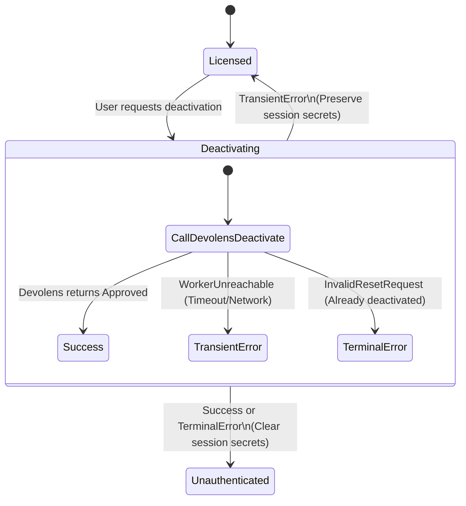

# Tauri Storage State & Deactivation Policy

This document maps the storage responsibilities of the Tauri desktop client licensing system, detailing where each piece of information resides, when/how it is modified or cleared, and the state transition rules for current-device deactivation.

## Storage Responsibilities Map

| Artifact | Primary Location | Fallback Location | Plaintext Policy | Lifetime / Clearing Event |
| :--- | :--- | :--- | :--- | :--- |
| **License Key** | `KeychainSecretStore` (OS Keychain/Keyring) | None (Never stored in fallback file) | **Plaintext**: Kept in Keychain. Never serialized in logs or plaintext files. | Cleared on successful/terminal deactivation or explicit admin reset. |
| **Access Token** | `KeychainSecretStore` | `secrets_fallback.json` (Encrypted with a platform-derived key) | **Encrypted**: Ciphertext stored in fallback file. | Cleared on successful/terminal deactivation or token revocation. |
| **Device Keypair** | `KeychainSecretStore` | `secrets_fallback.json` | **Encrypted**: Ciphertext stored in fallback file. | **Persistent**: Reused across sessions. Never cleared by deactivation or session resets. |
| **Device Identity** | `device_identity.json` (Disk) | None | public_key + private_key_material. | **Persistent**: Represents the device fingerprint itself. Not cleared. |
| **Auth State** | `auth_state.json` (Disk) | None | JSON representation of `SessionState`. | Updated on any transition (e.g. `Licensed` &rarr; `Unauthenticated`). |

---

## Deactivation State Machine

The deactivation process follows a strict state transition flow to prevent "stranding" device bindings (leaving a device bound on Devolens while the client thinks it is deactivated, consuming a license seat).

### Survival Policy on Deactivation Outcome

1. **Successful / Terminal Deactivation**
   - **Trigger**: Devolens endpoint `/api/key/Deactivate` returns success, or returns a terminal error indicating the key is already deactivated/revoked (e.g., `InvalidResetRequest`).
   - **Clearing Action**:
     - Clear `License Key` from primary keychain.
     - Clear `Access Token` from primary keychain and fallback secrets file.
     - Set Session State to `SessionState::Unauthenticated` (or appropriate reset state).
   - **Survival**: Only `Device Keypair` and `Device Identity` survive (to allow subsequent reuse of the same device key).

2. **Failed (Transient) Deactivation**
   - **Trigger**: Devolens endpoint `/api/key/Deactivate` fails due to network timeout or unreachable worker (`WorkerUnreachable`).
   - **Clearing Action**: **None**.
   - **Survival**: All fields (License Key, Access Token, Device Keypair, and the current Session State) **must survive** intact. This allows the user to retry the deactivation or remain in their offline-grace authenticated session.
